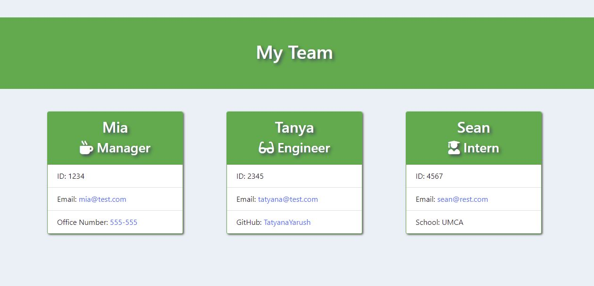

# team-profile-generator
10 Object-Oriented Programming: Team Profile Generator

(https://tatyanayarush.github.io/team-profile-generator/)


## Introduction

This is a node app that can create html file of your team members from your input to the prompts.

## User Story

```md
AS A manager
I WANT to generate a webpage that displays my team's basic info
SO THAT I have quick access to their emails and GitHub profiles
```

## Acceptance Criteria

```md
GIVEN a command-line application that accepts user input
WHEN I am prompted for my team members and their information
THEN an HTML file is generated that displays a nicely formatted team roster based on user input
WHEN I click on an email address in the HTML
THEN my default email program opens and populates the TO field of the email with the address
WHEN I click on the GitHub username
THEN that GitHub profile opens in a new tab
WHEN I start the application
THEN I am prompted to enter the team manager’s name, employee ID, email address, and office number
WHEN I enter the team manager’s name, employee ID, email address, and office number
THEN I am presented with a menu with the option to add an engineer or an intern or to finish building my team
WHEN I select the engineer option
THEN I am prompted to enter the engineer’s name, ID, email, and GitHub username, and I am taken back to the menu
WHEN I select the intern option
THEN I am prompted to enter the intern’s name, ID, email, and school, and I am taken back to the menu
WHEN I decide to finish building my team
THEN I exit the application, and the HTML is generated
```

## Installation
To install this application, first, branch the Github Repo and clone the repo to your local machine. Then, you will need to install the node dependencies which can be done by running the "npm install" command in your terminal/bash shell. Once this has been completed, you are ready to use the application!


## Run Tests:


## Walkthrough video team profile generator:


 - YouTube Video: [Walkthrough DemoVideo](https://www.youtube.com/watch?v=vzHBk1cwQl0)


## Webpage image: 



## Tools & Resources & Technologies

</br>
<p>


</p>


 ## Questions
 For any additional information or questions find me at:

 - Email: [tatyana.yarushin@gmail.com](mailto:tatyana.yarushin@gmail.com)
 
 - Github: [TatyanaYarush](https://github.com/TatyanaYarush)
